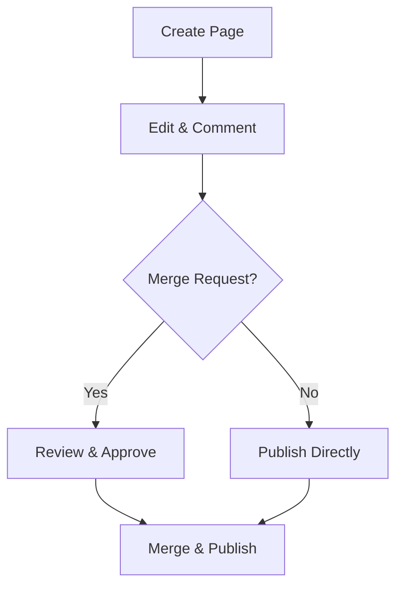

## Overview

You manage all your Pare Teknoloji documentation in this centralized space. Create new pages, track changes with version control, and collaborate seamlessly with your team. This guide covers the essential workflows to keep your docs organized and up-to-date.

<Columns cols={3}>
  <Card title="Document Creation" icon="file-plus" href="#document-creation">
    Start new docs quickly with templates.
  </Card>
  <Card title="Version Control" icon="git-branch" href="#version-control">
    Track changes and revert when needed.
  </Card>
  <Card title="Collaboration" icon="users" href="#collaboration">
    Share, review, and merge contributions.
  </Card>
</Columns>

## Document Creation

Follow these steps to create a new documentation page.

<Steps>
  <Step title="Navigate to Pages" icon="layout">
    Click the `Pages` menu in the sidebar. Select `New Page` from the dropdown.
  </Step>
  <Step title="Choose Template" icon="file-text">
    Pick a template like `Guide`, `API Reference`, or `Changelog`. Enter a title such as `API Quickstart`.
  </Step>
  <Step title="Add Content" icon="edit-3">
    Write in Markdown or MDX. Use frontmatter for metadata:

    ```
    ---
    title: Your Page Title
    description: Brief summary.
    ---
    ```

    Preview changes in real-time.
  </Step>
  <Step title="Publish" icon="upload">
    Click `Publish` to make it live. Set visibility to `Public` or `Team Only`.
  </Step>
</Steps>

<Callout kind="tip">
  Use YAML frontmatter without blank lines to avoid parsing errors. Always start content with H2 headings.
</Callout>

## Version Control

Pare Teknoloji integrates version control for safe editing. Track history and collaborate without conflicts.

<Tabs>
  <Tab title="View History" icon="clock">
    Open any page and click `History`. See a timeline of changes with diffs.

    | Version | Author | Date | Changes |
    |---------|--------|------|---------|
    | v1.2.0 | Alice | 2024-10-15 | Added Steps component |
    | v1.1.0 | Bob | 2024-10-10 | Fixed table syntax |
  </Tab>
  <Tab title="Revert Changes" icon="refresh-cw">
    Select a version and click `Revert`. Confirm to roll back.

    <CodeGroup tabs="CLI,UI">
    ```bash
    # Using integrated CLI
    pare revert --page "guide.mdx" --version v1.1.0
    ```
    ```javascript
    // API example
    await fetch('/api/pages/guide.mdx/revert', {
      method: 'POST',
      body: JSON.stringify({ version: 'v1.1.0' }),
      headers: { 'Authorization': 'Bearer YOUR_TOKEN' }
    });
    ```
    </CodeGroup>
  </Tab>
</Tabs>

## Collaboration Features

Enable team workflows with these tools.

<ExpandableGroup>
  <Expandable title="Invite Collaborators" default-open="true">
    Go to `Settings > Team`. Add users by email. Assign roles: `Editor`, `Reviewer`, or `Viewer`.

    Share links: `https://docs.pareteknoloji.com/team/project/page?share=abc123`
  </Expandable>
  <Expandable title="Inline Comments">
    Highlight text and add comments. `@mention` teammates for notifications.

    Resolve threads once addressed.
  </Expandable>
  <Expandable title="Merge Requests">
    Create a draft branch for changes. Submit a merge request with description.

    Reviewers approve or request edits before merging.
  </Expandable>
</ExpandableGroup>



<Callout kind="success">
  Collaboration reduces errors and speeds up reviews. Always use merge requests for team projects.
</Callout>

Organize pages into folders via drag-and-drop in the sidebar. Use tags for quick search: `guide`, `api`, `internal`. Export to PDF or GitHub repo anytime. Your documentation stays synchronized across all features.